# C++ _PDC _#09

## :copyright: Autor

- :camera: 

- :man: **Miguel Angel Rojas Herrera**
- :e-mail: m_rojas18@unitec.edu
- :link: [github.com/m_rojas18](https://github.com/m-rojas18)
- :calendar: 2020-08-30 18:00 CST

---
## :dart: Objetivos

Punto de Control #09 en C++ mostrara:

1.

2.

3.

## Asignación 1

## :black_large_square: 1) eof_get_y_put.cpp
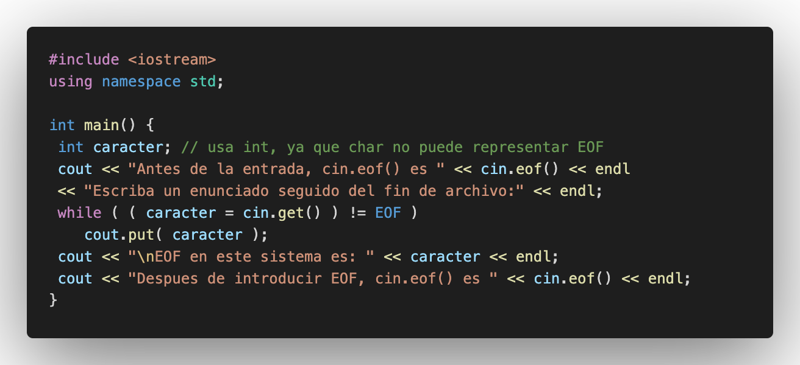

## :red_circle: Salida:
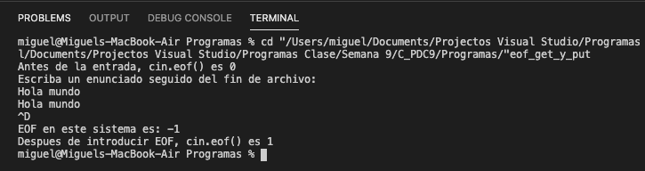

## Descripción:
->
## :black_large_square: 2) cin_y_cin-get.cpp
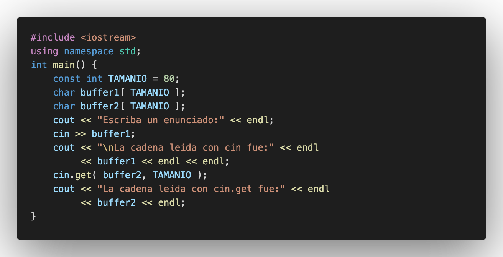

## :red_circle: Salida:

## Descripción:
->
## :black_large_square: 3) cin-getline.cpp

## :red_circle: Salida:
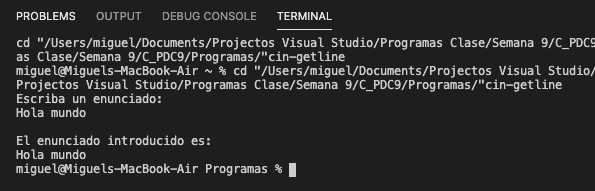

## Descripción:
->

## :black_large_square: 4) read_y_write.cpp
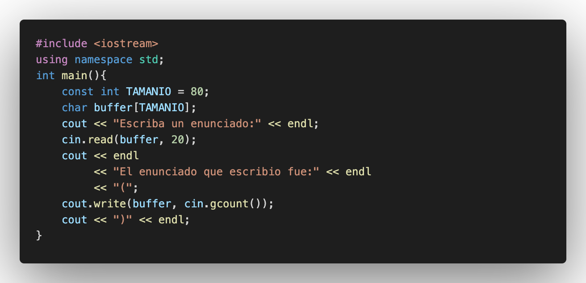

## :red_circle: Salida:
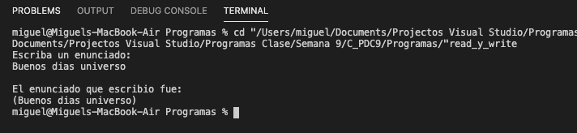

## Descripción:
->

## :black_large_square: 5) dec_oct_hex_y_setbase.cpp
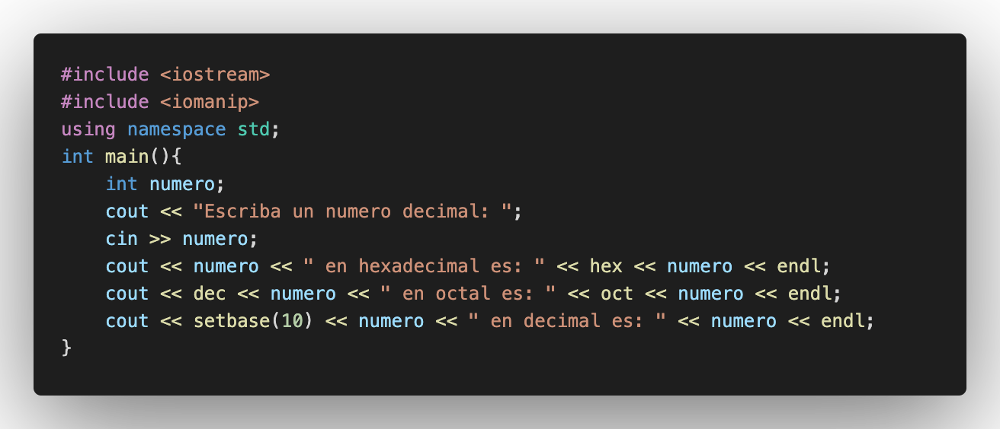

## :red_circle: Salida:
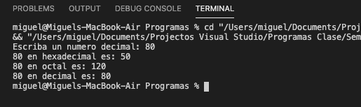

## Descripción:
->

## :black_large_square: 6) ejemplo_raiz_cuadrada.cpp
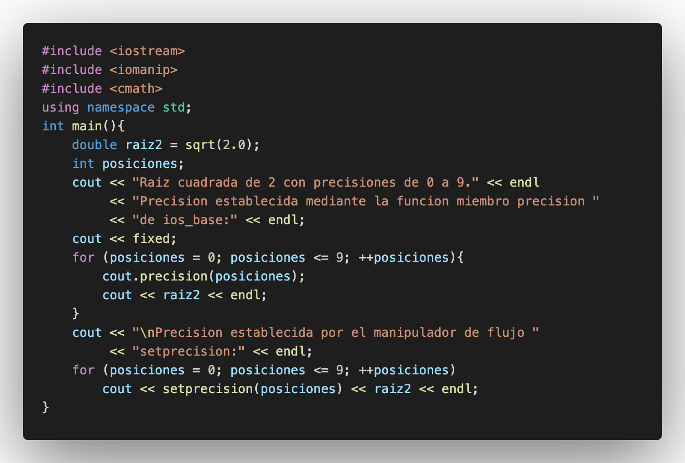

## :red_circle: Salida:
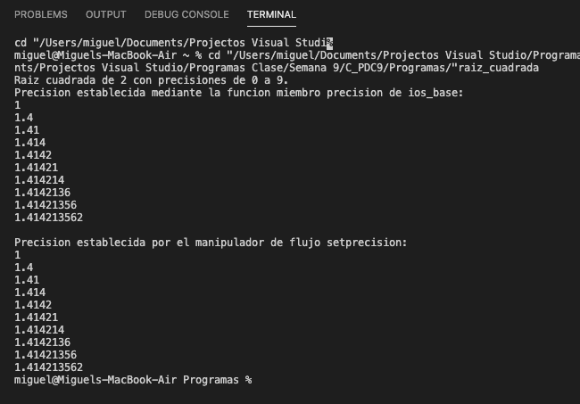

## Descripción:
->

## :black_large_square: 7) cout-width.cpp
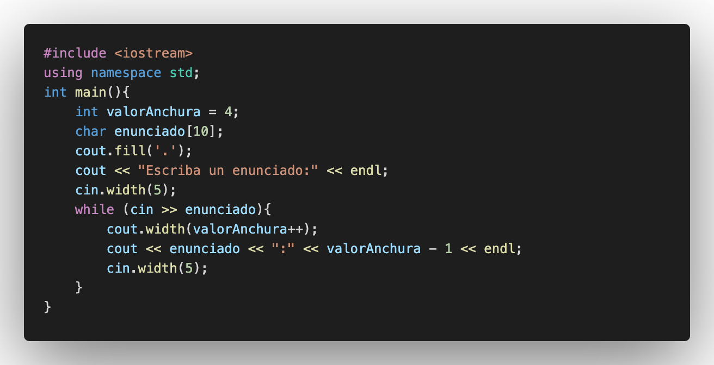

## :red_circle: Salida:

## Descripción:
->

## :black_large_square: 8) cout-setw.cpp
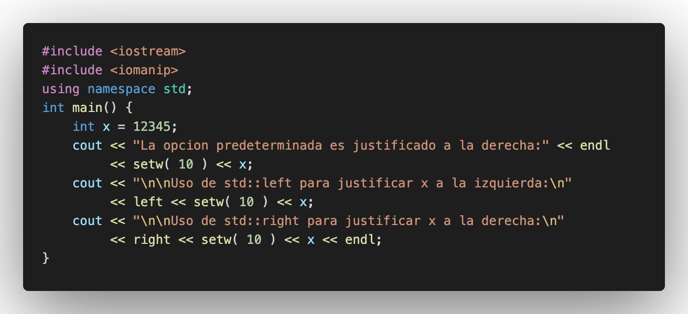

## :red_circle: Salida:
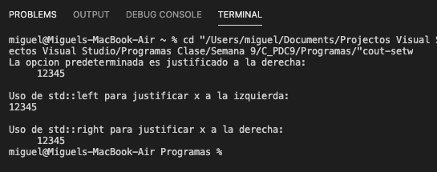

## Descripción:
->

## :black_large_square: 9) cout-setw_2.cpp
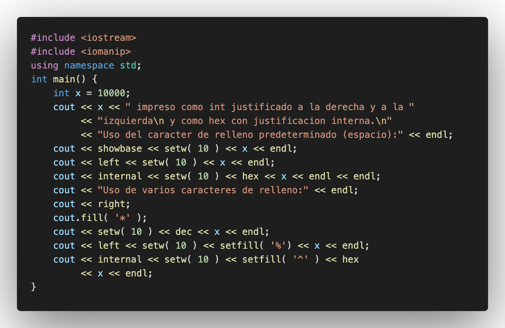

## :red_circle: Salida:
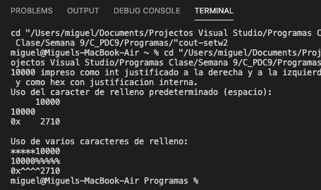

## Descripción:
->

## :black_large_square: 10) scientific_y_fixed.cpp
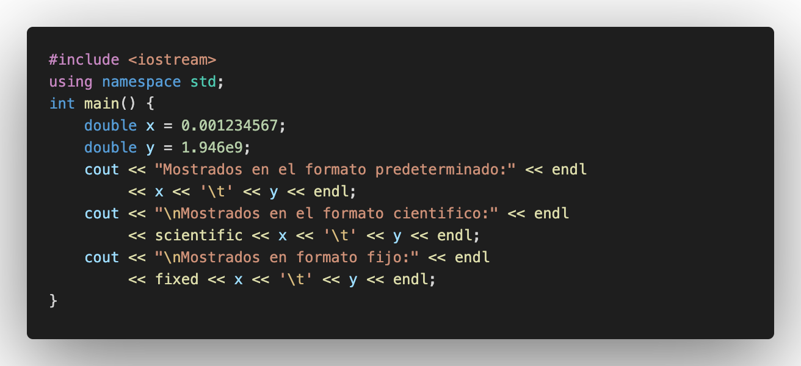

## :red_circle: Salida:
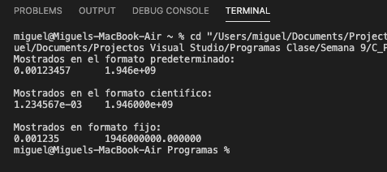

## Descripción:
->

## :black_large_square: 11) Ejemplo_creacion_archivo.cpp
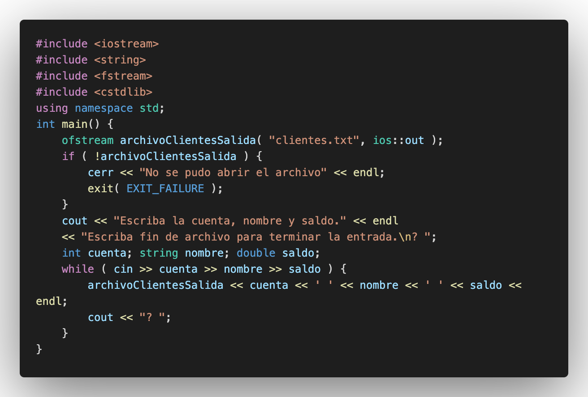

## :red_circle: Salida:
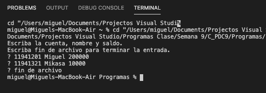

## Descripción:
->

## :black_large_square: 12) Ejemplo_apertura.cpp
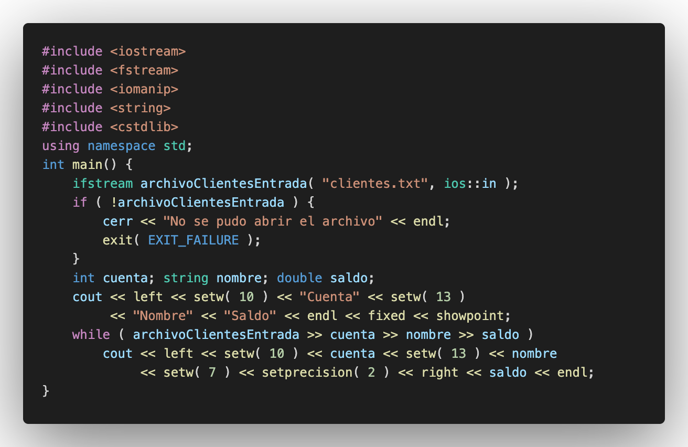

## :red_circle: Salida:
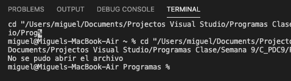
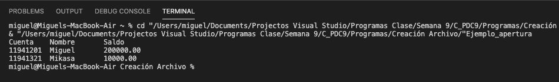

## Descripción:
->

## :black_large_square: 13) acceso_aleratorio.cpp
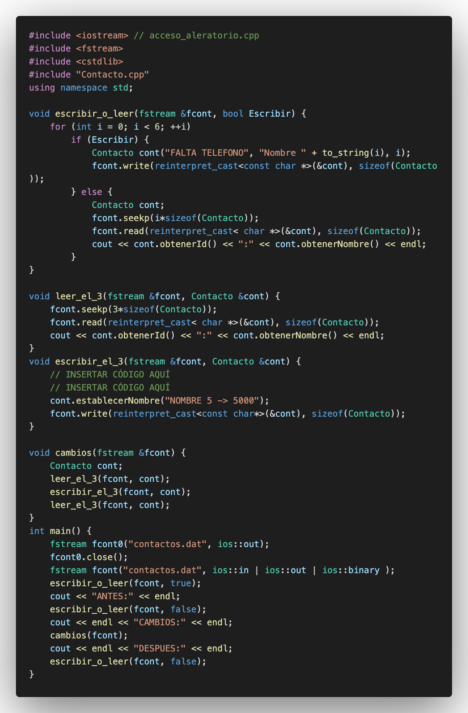
## :large_blue_circle: Contacto.hpp

## :large_blue_circle: Contacto.cpp
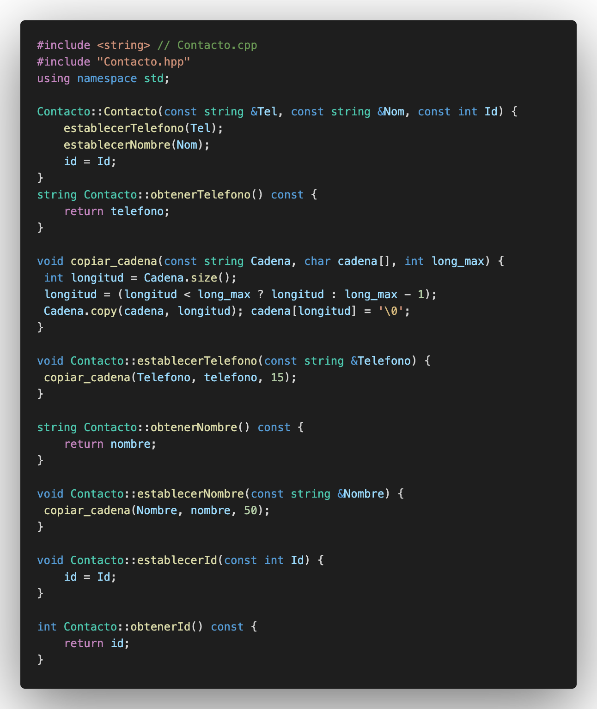
## :red_circle: Salida:

## Asignación 2

## Asignación 3

## :computer: Código
- :blue_book: [Punto de Control #09] (https://github.com/m-rojas18/C_PDC9.git)

#### Herramientas:
- :package: [Visual Studio Code](https://code.visualstudio.com/)
- :camera: [Polacode-2020 v0.5.2](https://github.com/jeff-hykin/polacode)
- :notebook: [Markdown Cheatsheet](https://github.com/adam-p/markdown-here/wiki/Markdown-Cheatsheet)
- :smile: [Emoji Cheat Sheet](https://www.webfx.com/tools/emoji-cheat-sheet/)
