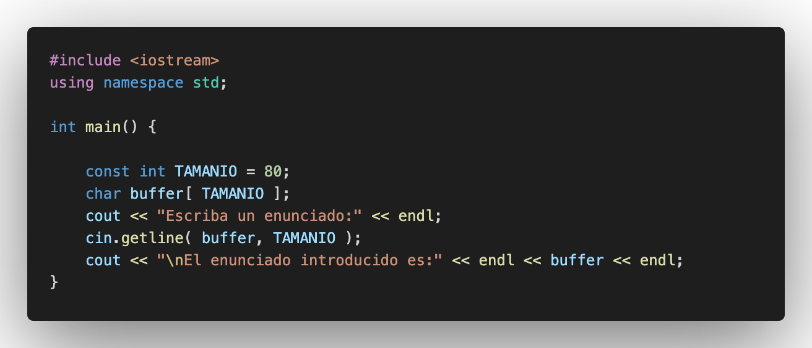
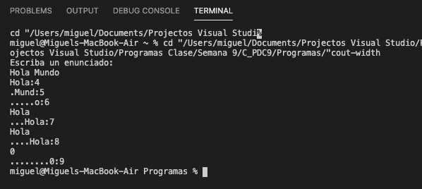
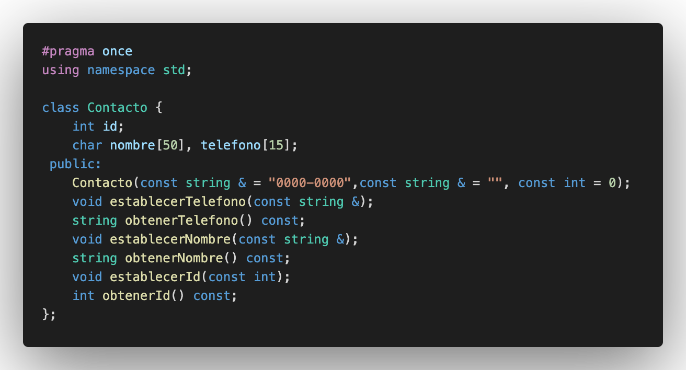

# C++ _PDC _#09

## :copyright: Autor

- :camera: 

- :man: **Miguel Angel Rojas Herrera**
- :e-mail: m_rojas18@unitec.edu
- :link: [github.com/m_rojas18](https://github.com/m-rojas18)
- :calendar: 2020-08-30 18:00 CST

---
## :dart: Objetivos

Punto de Control #09 en C++ mostrara:

1. Aprender sobre distintos metodos de entrada. (Ej. cin, cin.getline(),etc.)

2. Aprender sobre el uso de distintos metodos para valores numericos (Ej. scientific, setprecicision())

3. Uso de diferentes metodos de impresion como setw().

4. La creacion de archivos de texto y el manejo de como leerlo.

5. El uso para actualizar valores aleatorios.

## :pencil2: Asignación 1

## :black_large_square: 1) eof_get_y_put.cpp

## :red_circle: Salida:

## Descripción:
-> El programa utiliza el valor de EOF para mostrar como se termina el programa. El programa continua recibiendo entradas hasta que el usuario decida salirse.

## :black_large_square: 2) cin_y_cin-get.cpp

## :red_circle: Salida:

## Descripción:
-> El programa muestra las diferencias entre los metodos cin y cin.get() para guardar valores.
## :black_large_square: 3) cin-getline.cpp

## :red_circle: Salida:

## Descripción:
-> El programa muestra el uso del metodo cin.getline() para recibir datos.

## :black_large_square: 4) read_y_write.cpp

## :red_circle: Salida:

## Descripción:
->  El programa muestra el uso de los metodos read() y write().

## :black_large_square: 5) dec_oct_hex_y_setbase.cpp

## :red_circle: Salida:

## Descripción:
->  Este programa muestra la conversion de un numero a decimal, hexadecimal y octal.

## :black_large_square: 6) ejemplo_raiz_cuadrada.cpp

## :red_circle: Salida:

## Descripción:
->  El programa muestra una salida de la precision de una matriz cuadrada por la funcion miembro precision de ios_base y por otro metodo "setprecision()".

## :black_large_square: 7) cout-width.cpp

## :red_circle: Salida:

## Descripción:
->   El programa muestra el uso de el metodo .width() para mostrar el ancho de una cadena.

## :black_large_square: 8) cout-setw.cpp

## :red_circle: Salida:

## Descripción:
->   Este programa muestra el uso del metodo setw() para alinear las impresion de manera deseada.

## :black_large_square: 9) cout-setw_2.cpp

## :red_circle: Salida:

## Descripción:
->Este programa muestra el uso del metodo setw() para alinear las impresion de manera deseada y al mismo tiempo muestra el espacio requerido para dicha impresion

## :black_large_square: 10) scientific_y_fixed.cpp

## :red_circle: Salida:

## Descripción:
->   Este programa muestra la salida de valores mediante el uso de los metodos scientific y fixed.

## :black_large_square: 11) Ejemplo_creacion_archivo.cpp

## :red_circle: Salida:

## Descripción:
->  Este programa muestra la base para la creación de un archivo de texto.

## :black_large_square: 12) Ejemplo_apertura.cpp

## :red_circle: Salida:

## Descripción:
-> Este programa muestra la base para poder abrir un archivo y comprobar si existe o no.

## :black_large_square: 13) acceso_aleratorio.cpp

## :large_blue_diamond:Contacto.hpp

## :large_blue_diamond: Contacto.cpp

## :red_circle: Salida:

## Descripcion:
-> Este programa muestra una actualizacion de valores aleatorios incompleta.

## :pencil2: Asignación 2

## :large_blue_circle: acceso_aleatorio.cpp

## :large_blue_diamond: Contacto.hpp

## :large_blue_diamond: Contacto.cpp

## :red_circle: Salida

## Descripción
-> Este programa es la version completa del anterior, muestra la actualizacion pedida en la guia. Los cambios se realizaron en el metodo "escribir_el_3()".

## :pencil2: Asignación 3

## :white_large_square: acceso_aleatorio.cpp

## :large_orange_diamond: Operaciones.hpp

## :large_orange_diamond: Operaciones.cpp

## :large_orange_diamond: Contacto.hpp

## :large_orange_diamond: Contacto.cpp

## :red_circle: Salida:

## Descripción:
-> Es el mismo programa que en la Asignación 2, se optimizo el codigo al poner los metodos requeridos en su propia clase y al llamarlos desde el main.

## :computer: Código
- :blue_book: [Punto de Control #09] (https://github.com/m-rojas18/C_PDC9.git)

#### Herramientas:
- :package: [Visual Studio Code](https://code.visualstudio.com/)
- :camera: [Polacode-2020 v0.5.2](https://github.com/jeff-hykin/polacode)
- :notebook: [Markdown Cheatsheet](https://github.com/adam-p/markdown-here/wiki/Markdown-Cheatsheet)
- :smile: [Emoji Cheat Sheet](https://www.webfx.com/tools/emoji-cheat-sheet/)
